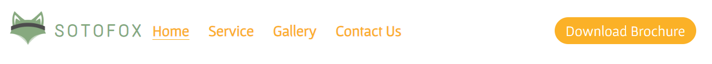
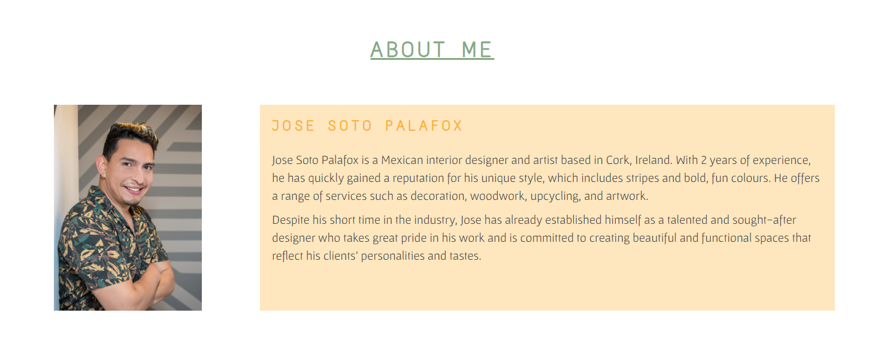
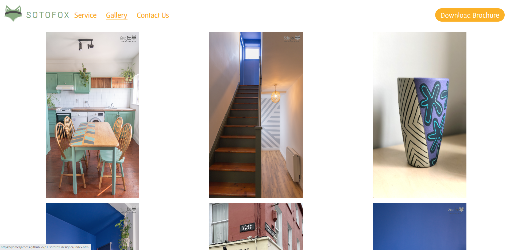
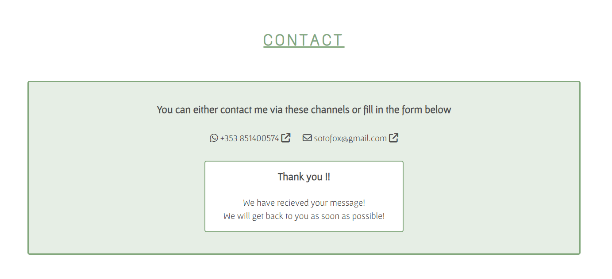
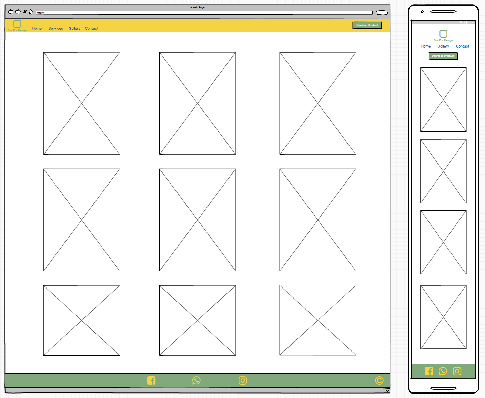
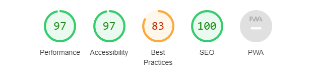
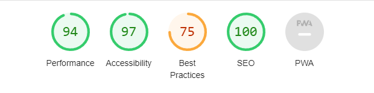
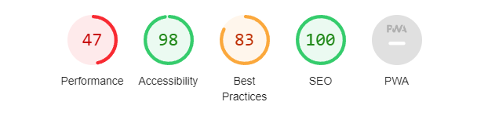

<h1 align="center">Sotofox Home Designer & Artist</h1>

[View the live project here](https://yamesjamess.github.io/p1-sotofox-designer/)

Sotofox Home Designer & Artist is a website dedicated to showcasing the interior renovation and design services offered by José Soto Palafox, a skilled artist and designer based in Cork, Ireland. With years of experience in the industry, José specializes in transforming spaces into beautiful and functional works of art. The main USP of this website is to provide a platform for potential clients to learn about José's unique approach to interior design, view his past projects, and get in touch with him to start their own renovation or design journey.

## Table of contents
* [User Experience (UX)](#user-experience-ux)
* [Features](#features)
* [Design](#design)
* [Technologies Used](#technologies-used)
* [Testing](#testing)
* [Deployment](#deployment)
* [Credits](#credits)

## User Experience (UX)

* #### A. First Time Visitor
    1. As a First Time  Visitor, I want to be able to understand what this website is about and learn more about the business.
    2. As a First Time  Visitor, I want to be able to easily navigate the website without any pain points in UI/UX design.
    3. As a First Time  Visitor, I want to be able to view the gallery to look at the artist's portfolio.
    4. As a First Time  Visitor, I want to be able to contact the business and download the brochure if I wanted to.
    5. As a First Time  Visitor, I want to be able to find what services this business offers.

* #### B. Returning Visitor
    1. As a Returning Visitor, I want to easily navigate the website to where I wanted to be easily and quickly
    2. As a Returning Visitor, I want to be able to give feedback or ask questions to the business owner.
    3. As a Returning Visitor, I want to be able to find what other services are provided in addition to the ones I already know.

## Features

### Existing Features

* **1 - Navigation Bar**
    * The navigation bar is placed on all three pages of the website to provide users with a cohesive and coherent feel to the website. It includes the logo of the business, Home, Services, Gallery, Contact, and Download Brochure button. The navigation bar is fully responsive on both larger and smaller screen sizes. On smaller screen sizes, the menus and the "download" button are located under the logo.
    * The contrasting, bright colour download button is placed separately on the right hand side of the screen to make it eye-catching, so the user can go straight to download the brochure if they needed.
        * This download button doesn't actually download, but rather takes the user to the contact page's Brochure section. This is to provide the business with a way to collect information from the user for marketing purposes.
        * The download button also has an effect when the user hovers their cursor on top to provide a visual guide and a more fun and interactive user experience.

    

* **2 - Index Page Hero Image and Cover Text**
    * The index page includes a Hero image with Cover text on top. The image is used to provide users with a visual context of who owns the business and how does his work look like. The purpose of the cover text is to provide users with a clear indication of the nature of the business.

    

* **3 - About Me**
    * The purpose of this section is to introduce the user to the owner and the artist of the business.
    * The image and the colour used to evoke warmth, cosiness, and friendliness feeling to the user.

    

* **4 - Services**
    * The Services section is there to lay out different types of services provided by the business.
    * The alternating colour is there to help separate each data in the table and made it more visually appealing.
    * This section is presented in 3 separate inline tables on a larger screen. On a smaller screen, the tables follow one another vertically.

    

* **5 - Footer**
    * The Footer is featured on all the pages and is identical on all pages. Making it easy to use and navigate.
    * The Footer consists of the social links to the business social pages and copyright.

    

* **6 - Gallery**
    * The Gallery features 9 most recent renovation works and artworks done by the business
    * The Gallery is laid out in a symmetrical 3x3 layout. This is to provide plenty of space for users to view the images.
    * The images in the Gallery also have a hover effect, which gives the Gallery a more fun and interactive user experience.
    * The Gallery is fully responsive and will show one image at a time on a smaller screen size. This is to also give users a better look at the image without overcrowding the smaller screen size

    

* **7 - Contact Page Hero Image**
    * The Contact page also features a hero image. This is done so that the website feels consistent with the other pages.
    
    

* **8 - Contact Form**
    * The Contact form allows the user to fill in their details into the text input such as their First Name, Last Name, and Email address. It also features a Text Area input for the user to write a message/questions/queries/feedback to the business.
    * The 'Send your message' button also has the same hover effect as the download button to keep it cohesive.
    
    

* **9 - Submitted Page**
    * The Submitted Page replaces the form when the user submits the form. This is to give the user a visual prompt that their information has been submitted.

    

* **10 - Brochure Download Button**
    * This button allows the user to click on it to download a PDF version of the brochure to their computer.
    * This button is also essential for users whose browsers do not support iFrames, since they can download the brochure and open it on their devices if the iFrame does not show up.

    

* **11 - Brochure iFrame**
    * The iFrame is placed to provide users who does not like to download things to their devices or find downloading unnecessary. They can have a quick glance at the brochure via the iFrame. Which aim is also to provide a better and interactive user experience.

    

## Design

### Imagery

*   The hero image was chosen because it features the owner of the business, José, standing in a room that he renovated, showcasing his expertise in interior design. The colours and patterns used in the room are also prominent features in the image, which helps to highlight e's unique style and artistic flair. The fact that the image is eye-catching and fun further help draw the user's attention to the page and would help develop an emotional attachment to the business.

### Colour Scheme

* The colour scheme is provided by the client. The two original colours are #81a97b and #f4d455. #ffb30f was later chosen due to the fact that #f4d455 was too light.

    

### Typography

* The original font provided by the client is 'Chewy' and 'Tenor Sans', but the client allows for personal freedom for the developer to select alternative font style. The fonts that were chosen are 'Gafata' and 'Text Me One'. They were selected because they work well together and provide a modern feel to the website.

### Wireframe

* Wireframes were created via Balsamiq

    * #### Index Page Wireframe
    
        

    * #### Gallery Page Wireframe
    
        

    * #### Contact Page Wireframe
    
        

## Technology Used

### Languages Used
* [HTML5](https://en.wikipedia.org/wiki/HTML5)
* [CSS3](https://en.wikipedia.org/wiki/CSS)

### Frameworks, Libraries & Other Tools Used
*   [Pixlr](https://pixlr.com//) was used to create a logo with transparent background since the logo provided is in the .JPEG format with white background.
*   [Google Fonts](https://fonts.google.com/) was used to import the fonts 'Gafata' and 'Text Me One' into the style.css, which are then linked to all the HTML pages of the project.
*   [Font Awesome:](https://fontawesome.com/) was used to add icons to convey the message of the sections and for aesthetic purposes of the UX
*   [Git:](https://git-scm.com/) was used for version controlling purposes through git commands via the terminal on GitPod and is pushed to GitHub for cloud-based storage.
*   [GitHub:](https://github.com/) is used to host the repository of the project and is also used for deployment of the website.
*   [Figma:](https://www.figma.com/) was used to create a wireframe during the initial design process.
*   [Balsamiq:](https://balsamiq.com/) was also used to create wireframes during the initial design process.
*   [Favicon.io:](https://favicon.io/) was used to generate a Favicon (a website icon that appears in the tab of the browser or when the website is saved to the bookmark bar) for the website.
*   [Coolors:](https://coolors.co/) was used to help generate alternative colours than the colour provided by the client for accessibility.
*   [Fontjoy:](https://fontjoy.com/) was used to generate fonts that pairs wells together.

## Testing

### Validator Testing

* W3C HTML Validator
    
    *   result for index.html

        
    *  result for gallery.html

        
    *   result for contact.html

        
    *   result for submitted.html

        

    *   Note: The hidden warnings

        

    * Full validation results are available on GitHub here:

        * <a href="https://github.com/yamesjamess/p1-sotofox-designer/blob/main/documentation/validation-results/html-validation-results-index.pdf" target="_blank">HTML Validation Results - Index </a>

        * <a href="https://github.com/yamesjamess/p1-sotofox-designer/blob/main/documentation/validation-results/html-validation-results-gallery.pdf" target="_blank">HTML Validation Results - Gallery </a>

        * <a href="https://github.com/yamesjamess/p1-sotofox-designer/blob/main/documentation/validation-results/html-validation-results-contact.pdf" target="_blank">HTML Validation Results - Contact </a>

        * <a href="https://github.com/yamesjamess/p1-sotofox-designer/blob/main/documentation/validation-results/html-validation-results-submit.pdf" target="_blank">HTML Validation Results - Submit </a>

* Jigsaw CSS Validator

    * result for style.css
    

    * Full validation results are available on GitHub here:

        * <a href="https://github.com/yamesjamess/p1-sotofox-designer/blob/main/documentation/validation-results/css-validation-results.pdf" target="_blank">CSS Validation Results - style.css</a>

* Lighthouse Accessibility Validator

    * The poor performance issue is due to the size and resolution of the images present on the website.

    *   result for index.html

        

    *   result for index.html (mobile)

          

    *  result for gallery.html

        

    *  result for gallery.html (mobile)

        

    *   result for contact.html

        

    *   result for contact.html (mobile)

        

    *   result for submitted.html

        

    *   result for submitted.html (mobile)

        
    

### Browser Compatibility

*   The website has been tested on these following broswes:
    * Google Chrome Version 110.0.5481.178 (Official Build) (64-bit)
    * Mozilla Firefox Version 110.0.1 (64-bit)
    * Microsoft Edge Version 110.0.1587.57 (Official build) (64-bit)
    * Apple Safari on macOS Ventura Version 16.3 (18614.4.6.1.6)
    * Apple Safari on iOS 16.0 (20A362)
    * DuckDuckGo Mobile Version 7.72.2.0

### Accessibility

* [WebAIM - Contrast Checker:](https://webaim.org/resources/contrastchecker/) was utilised during the design process to determine if the colour scheme would work in terms of readability and accessibility. 
    * Since the colour scheme was selected by the client in order to represent their business, there was some issues with readability and accessibility.
    * The colour #F4D455 was too light, so a darker shade #FFB30F was chosen instead.
    * To make the text more readable, the colour #FFFFFF and #4D4D4D was used when appropriate. 

* [Am I Responsive:](https://ui.dev/amiresponsive) was utilised to check if the website is responsive across different viewports.

* [Chrome DevTools:](https://developer.chrome.com/docs/devtools/) was also utilised to check if the website is responsive across different viewports.

### Test Case and Results

* The table below has listed all the test cases and details of how the test was performed, and the result of the test.

### Knwon Bugs

* The header has an odd section on it when inspect with chrome devtool and added outline to all header elements. 
    *   This is solved by adding height to the header element.

* The p element in the about-right section kept overflowing from the container where there's background-colour.
    *   This is partially fixed with multiple media queries but at some very specific pixel range it still overflows. 

* The iFrame on the contact & submit page sometimes does not load in. This most likely is because the browser simply just does not respond. After refreshing the iFrame shows up.

## Deployment

### How the website was deployed

* This website is deployed via GitHub Pages
    * From the GitHub Repository, navigate to the Settings tab, and select Pages from the menu on the left.
    * From there under the Branch section, select the Main branch and /root directory, and save your selection.
    * Once saved, GitHub will take a couple of minutes to host the website on their GitHub Pages service.
    * Once finished, the link to the deployed website will appear on the page.
    * Any commits pushed from the main branch of the repository will be updated to the live website by GitHub automatically.

    The live website can be found here [Sotofox Home Designer & Artist](https://yamesjamess.github.io/p1-sotofox-designer/)

### How to copy this repository

* Visit the main repository at https://github.com/yamesjamess/p1-sotofox-designer.
* Go to the https://github.com/elainebroche-dev/ms1-thrive repository on GitHub 
* Click the "Code" button to the right of the screen, click HTTPs and copy the link present there.
* Open a GitBash terminal and navigate to the directory where you want to clone.
* In the terminal, type "git clone" then paste in the copied URL and press the Enter key to begin the cloning process.

### How to fork this repository

* Visit the main repository at https://github.com/yamesjamess/p1-sotofox-designer.
* On the top right hand corner click on the "Fork" button.
* You will be redirected to a new page, from there enter the name you desire the name the forked repository and click "Create Fork"
* You will now have a Fork copy of the repository on your own repository.

## Credits

### Content

* The general inspiration for the website's layout comes from [Charlotte The Decorator](https://github.com/SamarZiadat/charlotte-the-decorator)
* All other content was written by the developer.

### Code

* Code on how to make the image in the gallery enlarge when hovered comes from this page: [Very Simple Responsive Image Gallery (Pure HTML CSS)](https://code-boxx.com/responsive-image-gallery-html-css/)
* Code on how to style table with CSS was adapted from: [Stack Overflow - Alternate table row color using CSS? - Answered By Russell Dias](https://stackoverflow.com/questions/3084261/alternate-table-row-color-using-css)
* Code on how to style form with CSS comes from: [Stack Overflow - Styling form so that they are side by side horizontally - Answered By EdenF](https://stackoverflow.com/questions/75550807/styling-form-so-that-they-are-side-by-side-horizontally)

### Media

* All images and documents present on the website are owned and proviced by the client.
* The colour scheme of the website is based on the colour that is provided by the client
* The favicon was created by uploading the client's logo through [Favicon.io](https://favicon.io/)
* All fonts used are imported from [Google Fonts](https://fonts.google.com/)

### Acknowledgements

* Thank you Alvaro Felipe Calle for helping me with some debugging
* Thank you for my mentor, Brian Macharia, for helping me with troubleshooting responsive designs of the overall page and the gallery. Also, for all the feedback and plannng process that you provided during our mentoring sessions.
* Thank you José Soto Palafox for letting me work on this project based on your business.
